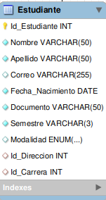
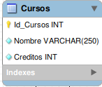
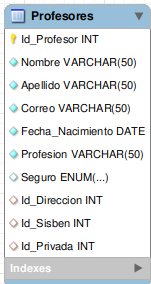
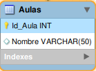
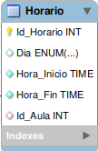
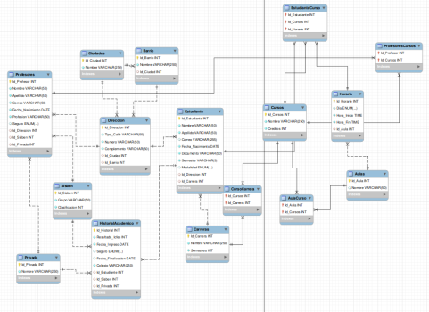

# Base de Datos Unviversidad Unimiuto

Se ha normalizado la base de datos de una univerdidad para que sea más eficiente y asi evitarle la redundancia de datos.

## Tabla de contenido 

| Indice | Titulo          |
| ------ | --------------- |
| 1      | Intalacion      |
| 2      | Tecnologias     |
| 3      | Entidades Prin  |
| 4      | Diagrama UML    |
| 5      | Normalizacion   |
| 6      | FAQs            |
| 7      | Licencia        |
| 8      | Grupo           |

## 1 Instalación 

```bash
git clone https://github.com/Stefanyyy15/Ejercicio8Oct_AdrianUstariz_YuliSanchez.git
cd Ejercicio8Oct_AdrianUstariz_YuliSanchez
code .
```

## 2 Tecnologias 

Lista de tecnologías utilizadas en el proyecto:

- [MySQL](<[https://developer.mozilla.org/en-US/docs/Web/MYSQL](https://developer.mozilla.org/en-US/docs/Web/MYSQL)>): Utilizado para la gestión de la base de datos relacional.

## 3 Entidades Principales 

### 3.1 Estudiante

- **Descripción**: Almacena la información básica de los estudiantes, facilitando la gestión de su inscripción en cursos.



### 3.2 Curso

- **Descripción:** Contiene los detalles de cada curso, incluyendo el docente asignado, aula y horario de clases.



### 3.3 Docente

- **Descripción:** Registra información sobre los docentes, permitiendo la asignación de cursos.



### 3.4 Aula

- **Descripción:** Información sobre las aulas disponibles para la realización de clases.




### 3.5 Horario

- **Descripción:** Información sobre las horarios disponibles para la realización de clases.



## 4 Diagrama UML - ER



## 5 Normalizacion

- **Primera Forma Normal (1NF):**

Se eliminaron grupos repetitivos creando tablas separadas para cada entidad principal (Estudiante, Cursos, Profesores, etc.).
Se identificaron claves primarias únicas para cada tabla.
Se aseguró la atomicidad de los datos, por ejemplo, separando Nombre y Apellido.


- **Segunda Forma Normal (2NF):**

Se eliminaron dependencias parciales mediante la creación de tablas de relación como EstudianteCurso, CursoCarrera, ProfesoresCursos.
Se crearon tablas separadas para entidades relacionadas, como la tabla Carreras.


- **Tercera Forma Normal (3NF):**

Se eliminaron dependencias transitivas creando tablas separadas para Direccion, Ciudades y Barrio.
Se normalizaron datos repetitivos con tablas como Sisben y Privada para manejar información de seguros.

- **Cuarta Forma Normal (4NF):**

Se eliminaron dependencias multivaluadas con tablas como EstudianteCurso.

## 6 FAQs 

Lista de preguntas frecuentes:

1. ¿Cómo puedo contribuir al proyecto?
   _Puedes contribuir creando un fork del repositorio y enviando un pull request._

2. ¿Este proyecto está abierto a contribuciones?
   | Tipo de contribución | Aceptado | Comentarios |
   |:---------------------|:--------:|------------:|
   | Reporte de errores | Sí | Utiliza la sección de issues en GitHub |
   | Nuevas características| Sí | Envía un pull request con tus propuestas |

## 7 Licencia 

Este proyecto está licenciado bajo la Licencia MIT.

> La Licencia MIT es una licencia de software libre permisiva que es ampliamente utilizada en la comunidad de software

## 8 Grupo

Nuestro Grupo esta conformado por:
- Adrian Daniel Ustariz Ortiz
- Yuli Stefany Sanchez Santos